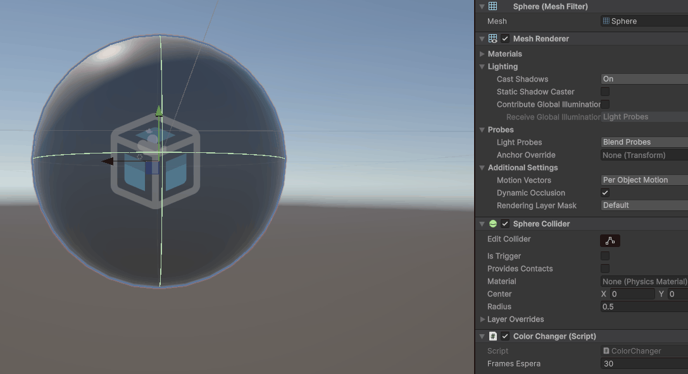
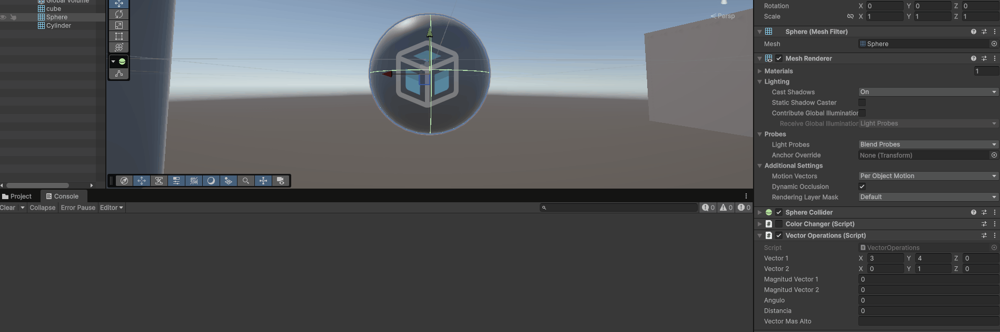
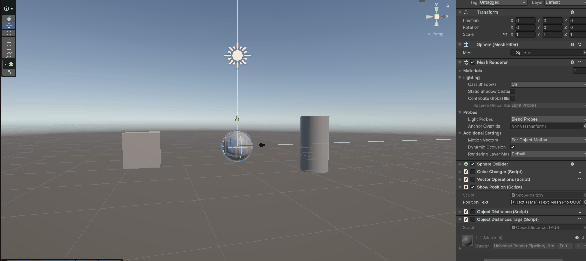
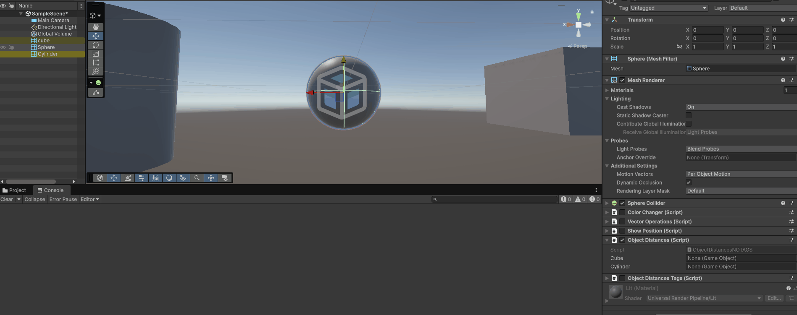
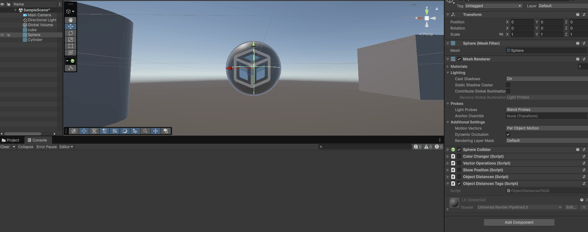

# Práctica 1 - Introducción a Unity

## Ejercicio 1 - Cambio de color

Se implementó el script `ColorChanger.cs`, encargado de modificar el color de un objeto de la escena.

El color se representa mediante un `Vector3`, cuyas tres componentes contienen valores entre `0.0` y `1.0` y se utilizan como componentes RGB.

Cada cierto número de frames se selecciona aleatoriamente una de las tres componentes y se sustituye su valor por uno nuevo generado mediante `Random.Range()`.

El número de frames entre cada modificación se almacena en una variable pública, permitiendo modificarlo directamente desde el Inspector de Unity.

### Ejecución



---

## Ejercicio 2 - Operaciones con vectores

Se implementó el script `VectorOperations.cs`, asociado a la esfera.

El script dispone de dos variables públicas de tipo `Vector3`, cuyos valores pueden establecerse desde el Inspector.

A partir de estos vectores se calculan:

- La magnitud de cada vector.
- El ángulo que forman entre ellos.
- La distancia entre ambos.
- Qué vector se encuentra a mayor altura comparando su componente `Y`.

Los resultados se muestran tanto en el Inspector como en la consola de Unity.

Para realizar los cálculos se utilizan las operaciones proporcionadas por la clase `Vector3`, como `magnitude`, `Vector3.Angle()` y `Vector3.Distance()`.

### Ejecución



---

## Ejercicio 3 - Posición de la esfera

Se implementó el script `ShowPosition.cs` para obtener y mostrar en pantalla la posición actual de la esfera.

Para ello se recupera una referencia a su componente `Transform` mediante:

```csharp
GetComponent<Transform>()
```

Posteriormente se consulta la propiedad:

```csharp
transform.position
```

que devuelve un `Vector3` con las coordenadas `(X, Y, Z)` del objeto.

Para mostrar esta información directamente en la interfaz del juego se añadió un elemento `TextMeshPro` dentro de un `Canvas`. El script mantiene una referencia pública al componente de texto:

```csharp
public TMP_Text positionText;
```

Esta referencia se asigna desde el Inspector y, en cada ejecución de `Update()`, se actualiza el contenido del texto con la posición actual de la esfera:

```csharp
positionText.text = "Posición de la esfera: " + sphereTransform.position;
```

De esta forma, cualquier cambio en la posición de la esfera se refleja inmediatamente en pantalla.

### Ejecución



---

## Ejercicio 4 - Distancia entre objetos

Se implementó el cálculo de la distancia existente entre la esfera y los objetos `Cube` y `Cylinder`.

Para ello se obtienen las posiciones de los tres objetos mediante sus componentes `Transform` y se utiliza:

```csharp
Vector3.Distance()
```

Se realizaron dos versiones para probar distintas formas de obtener referencias a otros `GameObject` de la escena.

### Versión 1 - Referencias desde el Inspector

En `ObjectDistances.cs` se utilizan dos variables públicas de tipo `GameObject`:

```csharp
public GameObject cube;
public GameObject cylinder;
```

Los objetos correspondientes se asignan manualmente desde el Inspector arrastrando el cubo y el cilindro sobre sus respectivos campos.

A partir de estas referencias se accede a sus componentes `Transform` y se calculan las distancias respecto a la esfera.

#### Ejecución



### Versión 2 - Búsqueda mediante Tags

También se realizó una segunda versión mediante el script `ObjectDistancesTags.cs`.

En este caso los objetos se localizan automáticamente utilizando:

```csharp
GameObject.FindWithTag()
```

Para ello se asignaron los siguientes tags:

- `cubito` al cubo.
- `cilindrito` al cilindro.

Una vez obtenida la referencia al `GameObject`, se accede a su posición mediante:

```csharp
gameObject.transform.position
```

Esta versión permite obtener las referencias sin necesidad de asignarlas manualmente desde el Inspector.

#### Ejecución


