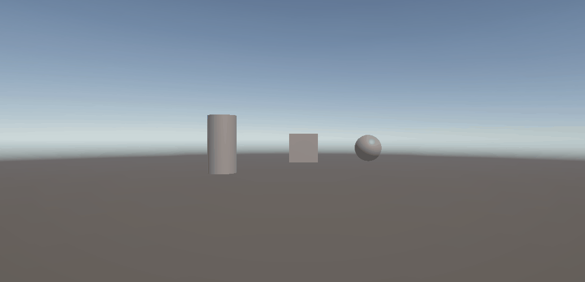
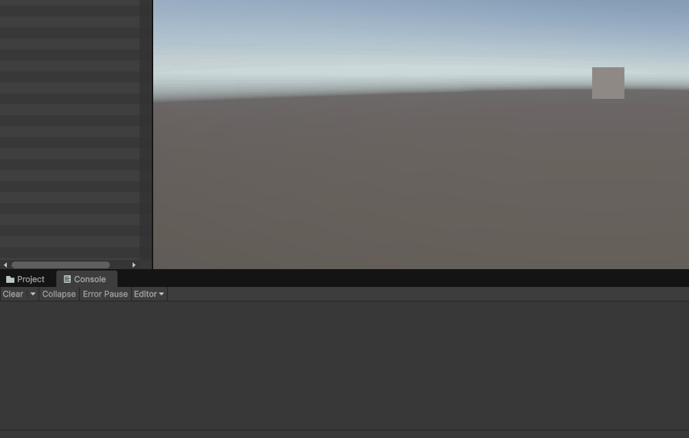
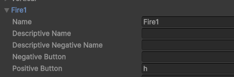
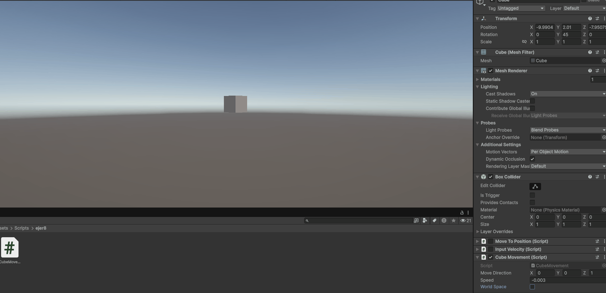
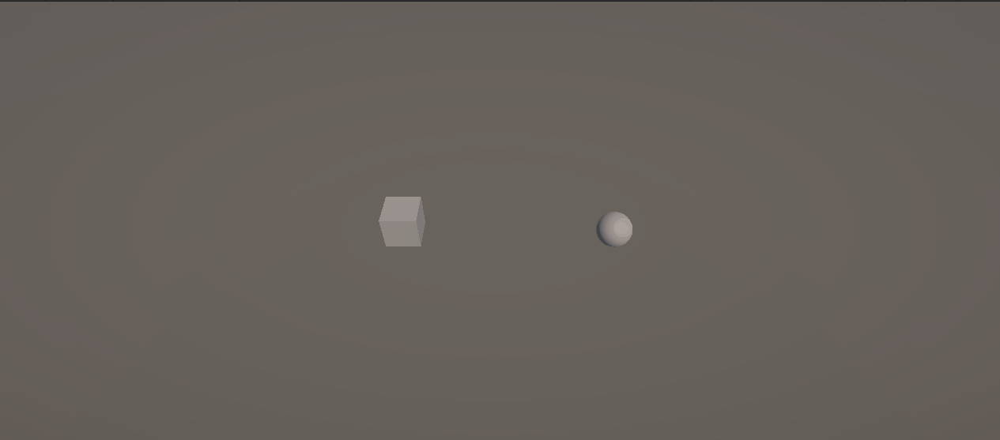
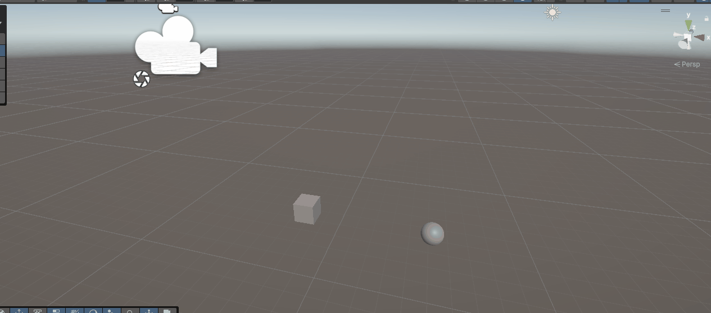
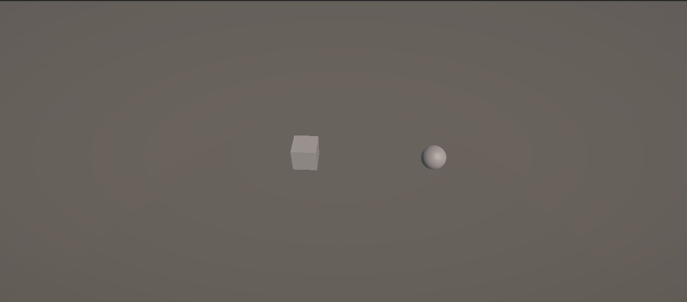

# Práctica 2

## Ejercicio 5 - Desplazamiento mediante la barra espaciadora

Se implementó el script `MoveToPosition.cs`, asociado a los tres objetos de la escena.

Cada objeto dispone de una variable pública de tipo `Vector3` denominada `desplazamiento`, que puede configurarse de forma independiente desde el Inspector.

Al iniciar la ejecución se almacena la posición original del objeto:

```csharp
posicionInicial = transform.position;
```

Durante la ejecución se comprueba el eje virtual `Jump` mediante:

```csharp
Input.GetAxis("Jump")
```

Al pulsar la barra espaciadora, cada objeto pasa a una nueva posición calculada sumando a su posición inicial el desplazamiento configurado:

```csharp
transform.position = posicionInicial + desplazamiento;
```

De esta forma, los tres objetos utilizan el mismo script pero cada uno puede tener un desplazamiento diferente.

### Ejecución



---

## Ejercicio 6 - Entrada mediante ejes Horizontal y Vertical

Se implementó el script `InputVelocity.cs` asociado al cubo.

El script dispone de una variable pública `velocidad`, cuyo valor puede modificarse desde el Inspector.

En cada frame se consultan los ejes virtuales `Horizontal` y `Vertical`:

```csharp
float horizontal = Input.GetAxis("Horizontal");
float vertical = Input.GetAxis("Vertical");
```

También se utiliza `Input.GetKey()` junto con `KeyCode` para determinar qué flecha concreta está siendo pulsada.

Según la tecla utilizada, se muestra en consola el resultado de multiplicar la velocidad por el valor del eje correspondiente:

```csharp
velocidad * horizontal
velocidad * vertical
```

Los valores devueltos por `Input.GetAxis()` varían entre `-1` y `1`. Además, al utilizar los ejes configurados por defecto en Unity, puede observarse una transición gradual de los valores debido al suavizado de la entrada.

### Ejecución



---

## Ejercicio 7 - Mapeo de la tecla H a la función de disparo

Para este ejercicio se utilizó el `Input Manager` de Unity.

Dentro de:

`Project Settings → Input Manager → Axes → Fire1`

se modificó el campo `Positive Button` para asignarle la tecla:

```text
h
```

De esta forma, la acción virtual `Fire1` puede activarse mediante la tecla `H`.

Este ejercicio permite comprobar cómo Unity puede desacoplar una acción lógica, como `Fire1`, de la tecla física utilizada para activarla.

### Configuración



---

## Ejercicio 8 - Movimiento mediante Translate

Se implementó el script `CubeMovement.cs`, asociado al cubo.

El movimiento se define mediante dos propiedades públicas configurables desde el Inspector:

```csharp
public Vector3 moveDirection;
public float speed;
```

En cada iteración de `Update()` el cubo se desplaza utilizando el método `Translate()`:

```csharp
transform.Translate(moveDirection * speed);
```

También se añadió la posibilidad de seleccionar desde el Inspector si el movimiento debe realizarse respecto al sistema de referencia local del cubo o respecto al sistema de referencia global:

```csharp
transform.Translate(moveDirection * speed, Space.Self);
transform.Translate(moveDirection * speed, Space.World);
```

### Pruebas realizadas

Se realizaron las distintas pruebas indicadas en el enunciado:

- **Duplicar las coordenadas de `moveDirection`:** al duplicar la magnitud del vector de dirección también se duplica el desplazamiento realizado en cada frame.
- **Duplicar `speed`:** manteniendo la misma dirección, duplicar la velocidad produce igualmente el doble de desplazamiento en cada frame.
- **Utilizar una velocidad menor que 1:** el cubo continúa moviéndose, pero recorre una distancia menor en cada iteración.
- **Situar inicialmente el cubo con `y > 0`:** cuando la componente Y de `moveDirection` es igual a 0, el cubo conserva su altura durante el movimiento.
- **Movimiento local y mundial:** con `Space.Self`, el desplazamiento se calcula respecto a los ejes locales del cubo, por lo que su rotación afecta a la dirección del movimiento. Con `Space.World`, el desplazamiento utiliza los ejes globales y no depende de la orientación del objeto.

Para visualizar claramente la diferencia entre ambos sistemas de referencia se realizó una prueba rotando el cubo `45°` sobre el eje Y.

En este ejercicio el movimiento todavía no se escala mediante `Time.deltaTime`, por lo que la cantidad desplazada se aplica una vez por frame.


### Ejecución



---

## Ejercicio 9 - Movimiento mediante teclado

Se implementaron dos scripts independientes para controlar el movimiento del cubo y de la esfera.

El cubo se controla mediante las teclas de dirección, mientras que la esfera utiliza las teclas `W`, `A`, `S` y `D`.

En cada script se construye un vector de movimiento dependiendo de las teclas que se encuentren pulsadas:

```csharp
if (Input.GetKey(KeyCode.UpArrow))
    movimiento += Vector3.forward;

if (Input.GetKey(KeyCode.DownArrow))
    movimiento += Vector3.back;

if (Input.GetKey(KeyCode.LeftArrow))
    movimiento += Vector3.left;

if (Input.GetKey(KeyCode.RightArrow))
    movimiento += Vector3.right;
```

En el caso de la esfera se realiza el mismo procedimiento utilizando las teclas `W`, `A`, `S` y `D`.

Posteriormente se aplica el movimiento mediante:

```csharp
transform.Translate(movimiento * speed, Space.World);
```

El uso de `Space.World` hace que el desplazamiento se realice respecto a los ejes globales de la escena.

En este ejercicio todavía no se utiliza `Time.deltaTime`, por lo que la cantidad desplazada depende del número de frames generados.

### Ejecución



---

## Ejercicio 10 - Movimiento independiente del framerate

El movimiento implementado en el ejercicio anterior se modificó para hacerlo proporcional al tiempo transcurrido entre frames.

Para ello se añadió `Time.deltaTime` al cálculo del desplazamiento:

```csharp
transform.Translate(
    movimiento * speed * Time.deltaTime,
    Space.World
);
```

De esta forma, `speed` representa una velocidad aproximada en unidades por segundo en lugar de una cantidad de desplazamiento aplicada en cada frame.

Esto evita que un equipo que genere más frames por segundo produzca un movimiento más rápido que otro con una tasa de frames inferior.

Debido a este cambio, también fue necesario aumentar los valores utilizados para `speed`, ya que valores como `0.1`, adecuados para un desplazamiento por frame, producen un movimiento muy lento al interpretarse como unidades por segundo.

### Ejecución


---

## Ejercicio 11 - Seguimiento de la esfera

Se implementó el script `FollowSphere.cs`, encargado de hacer que el cubo avance automáticamente hacia la posición de la esfera.

La dirección hacia el objetivo se calcula restando la posición del cubo a la posición de la esfera:

```csharp
Vector3 direccion = sphere.position - transform.position;
```

Como el cubo no debe modificar su altura, se elimina la componente vertical del vector:

```csharp
direccion.y = 0;
```

Posteriormente se normaliza el vector:

```csharp
direccion = direccion.normalized;
```

La normalización permite conservar únicamente la dirección del movimiento con una magnitud igual a 1. De esta manera, la velocidad del cubo no depende de la distancia a la que se encuentre la esfera.

Finalmente se realiza el desplazamiento mediante:

```csharp
transform.Translate(
    direccion * speed * Time.deltaTime,
    Space.World
);
```

La esfera mantiene el control mediante `WASD`, por lo que durante la ejecución se puede modificar su posición y observar cómo el cubo recalcula continuamente la dirección necesaria para seguirla.

### Ejecución



---

## Ejercicio 12 - Seguimiento orientado hacia la esfera

El movimiento del ejercicio anterior se modificó para que el cubo, además de avanzar hacia la esfera, oriente continuamente su eje Z positivo hacia ella.

Para realizar esta rotación se utiliza:

```csharp
transform.LookAt(sphere);
```

El vector de desplazamiento continúa calculándose mediante la diferencia entre ambas posiciones, eliminando su componente Y para que el cubo mantenga constante su altura:

```csharp
Vector3 direccion = sphere.position - transform.position;

direccion.y = 0;
direccion = direccion.normalized;
```

El movimiento continúa realizándose respecto al sistema de referencia mundial:

```csharp
transform.Translate(
    direccion * speed * Time.deltaTime,
    Space.World
);
```

Durante la ejecución, al mover la esfera mediante `WASD`, el cubo modifica continuamente tanto su dirección de desplazamiento como su orientación para mantenerse mirando hacia ella.

Aunque el desplazamiento del cubo no modifica su coordenada Y, `LookAt()` orienta directamente el objeto hacia la posición de la esfera, por lo que su rotación puede variar también si ambos objetos se encuentran a distintas alturas.

### Ejecución



---

## Ejercicio 13 - Avance continuo y control de orientación

En este ejercicio se modificó el comportamiento del cubo para que avance continuamente en la dirección correspondiente a su eje Z positivo local.

El eje virtual `Horizontal` se utiliza para controlar la rotación:

```csharp
float horizontal = Input.GetAxis("Horizontal");
```

El valor obtenido se emplea para girar el cubo alrededor de su eje Y:

```csharp
transform.Rotate(
    0,
    horizontal * rotationSpeed * Time.deltaTime,
    0
);
```

El desplazamiento se realiza utilizando:

```csharp
transform.forward
```

que representa la dirección actual del eje Z positivo del objeto:

```csharp
transform.position +=
    transform.forward * speed * Time.deltaTime;
```

A diferencia de `Vector3.forward`, que representa siempre la dirección global `(0, 0, 1)`, `transform.forward` cambia al modificar la orientación del cubo.

Como resultado, el objeto avanza continuamente y las entradas del eje `Horizontal` permiten modificar progresivamente la dirección en la que se desplaza.

### Ejecución


